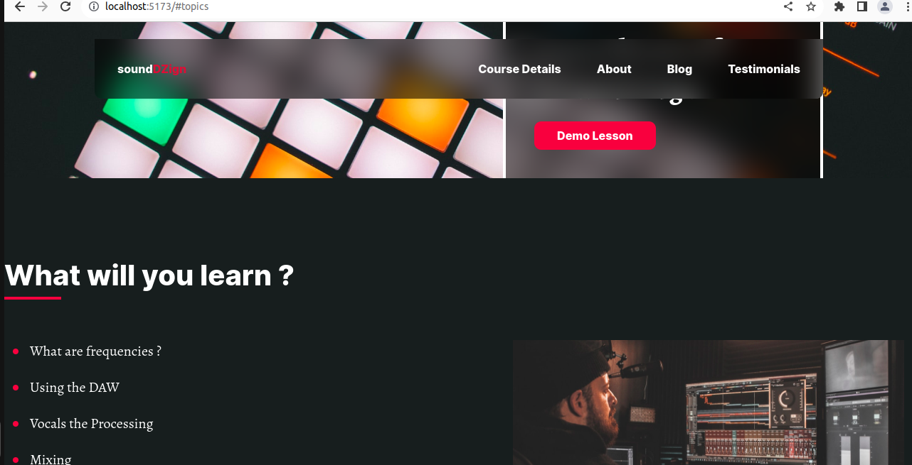

<div align ="center">

 
 
  <br/>

  <h3><b>Proffesional Website</b></h3>

</div>


<!-- TABLE OF CONTENTS -->

# 📗 Table of Contents

- [📖 About the Project](#about-project)
  - [🛠 Built With](#built-with)
    - [Tech Stack](#tech-stack)
    - [Key Features](#key-features)
  - [🚀 Live Demo](#live-demo)
- [💻 Getting Started](#getting-started)
  - [Setup](#setup)
  - [Prerequisites](#prerequisites)
  - [Install](#install)
  - [Usage](#usage)
  - [Run tests](#run-tests)
  - [Deployment](#triangular_flag_on_post-deployment)
- [👥 Authors](#authors)
- [🔭 Future Features](#future-features)
- [🤝 Contributing](#contributing)
- [⭐️ Show your support](#support)
- [🙏 Acknowledgements](#acknowledgements)
- [❓ FAQ (OPTIONAL)](#faq)
- [📝 License](#license)

<!-- PROJECT DESCRIPTION -->

# 📖 Web site <a name="about-project"></a>

**Web site** is designed using single page application (SPA) model  and written in React looking at a Figma Design.


## 🛠 Built With <a name="built-with"></a>

This project was built using React  and Vite.

### Tech Stack <a name="tech-stack"></a>

<details>
  <summary>Client</summary>
  <ul>
    <li><a href="https://reactjs.org/">React.js</a></li>
    <li><a href="https://vitejs.dev/guide/">Vite</a></li>
</details>

<!-- Features -->

### Key Features <a name="key-features"></a>

- **Proffesional Website**

<p align="right">(<a href="#readme-top">back to top</a>)</p>

<!-- LIVE DEMO -->

## 🚀 Live Demo <a name="live-demo"></a>

[live-demo](https://websiteforom.netlify.app/)

<p align="right">(<a href="#readme-top">back to top</a>)</p>

<!-- GETTING STARTED -->

## 💻 Getting Started <a name="getting-started"></a>

To get a local copy up and running, follow these steps.

### Prerequisites

In order to run this project you need:
- A personal computer connected to the internet
- A Modern/Updated web browser
- Have a local version control like git installed on your computer and a Github account
- Code editor (Visual studio code, sublime text, notepad++, ...) installed on your computer
- [Node.js](https://nodejs.org/en/)
- [npm](https://www.npmjs.com/)
- [React](https://reactjs.org/)

### Setup

Clone this repository to your desired folder:

```sh
git clone  https://github.com/josuerushanika/web-site
```

### Install

Install this project with:

```sh
npm install
```

### Usage

To run the project, execute the following command:

```sh
npm run dev
```

<p align="right">(<a href="#readme-top">back to top</a>)</p>

<!-- AUTHORS -->

## 👥 Author <a name="authors"></a>

👤 **Josue Rushanika**

- GitHub: https://github.com/josuerushanika
- Twitter: https://twitter.com/josuerushanika
- LinkedIn: https://www.linkedin.com/in/josue-rushanika-336049b3/


<p align="right">(<a href="#readme-top">back to top</a>)</p>

<!-- Future features -->

## 🔭 Future Features <a name="future-features"></a>
- [ ] **Add more functionality to the calculator**
- [ ] **Add Live demo link**

<!-- CONTRIBUTING -->

## 🤝 Contributing <a name="contributing"></a>

Contributions, issues, and feature requests are welcome!

Feel free to check the [issues page](https://github.com/josuerushanika/web-site/issues).

<p align="right">(<a href="#readme-top">back to top</a>)</p>

<!-- SUPPORT -->

## ⭐️ Show your support <a name="support"></a>

If you like this project and want to show your support, please give it a ⭐️!

<p align="right">(<a href="#readme-top">back to top</a>)</p>

<!-- ACKNOWLEDGEMENTS -->

## 🙏 Acknowledgments <a name="acknowledgements"></a>

I would like to thank  everyone who inspired me to learn programming and Youtube Turoriel and  Figma <a href="https://www.figma.com/file/wy22TBPVbKLedUWMG6NZjK/Responsive-Homepage?type=design&node-id=0-1&mode=design&t=X2gxbHDI4614vF2z-0">Figma Link</a>
  

<p align="right">(<a href="#readme-top">back to top</a>)</p>


<!-- LICENSE -->

## 📝 License <a name="license"></a>

This project is MIT [MIT](./MIT.md) licensed.

<p align="right">(<a href="#readme-top">back to top</a>)</p>

